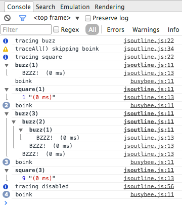

# jsoutline
JavaScript tracing using console.group() for collapsible nested calls along with args, returns and timing

## Purpose

Provide a tool which traces the call tree of JavaScript in a dev-tools 
equipped browser (or in node-inspect) and lets one collapse and expand the nested
sections using 
[console.group()](https://developer.mozilla.org/en-US/docs/Web/API/Console.groupCollapsed). 

## Usage
    jsoutline.traceAll(someobj_or_class, recurse, skiplist);
    jsoutline.showClassName = true; // default
    jsoutline.showObjectClass = false; // default, whether to show className when it is 'Object'
    someobj_or_class.do_something_tricky(); // view the output in Chrome/FF/Safari console
    jsoutline.squelch = true; // turn off the outlining
    someojb_or_class.do_something_boring();
  
## Credit

At the outset of this project I looked around for a JS equivalent of my 
[pyoutline](https://github.com/smurp/pyoutline) and found some code by Angus Croll:
    https://javascriptweblog.wordpress.com/2010/06/01/a-tracer-utility-in-2kb/

I based this implementation on his fine work.

## Discredit?

This has nothing to do with Nick Retallack's similarly named (and quite cool)
[JSOoutline](https://github.com/nickretallack/JSOutline)
which I only discovered *after* getting this out.
